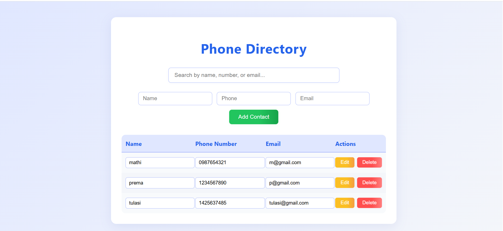

# Phone Book Manager

A web-based phone book manager for storing, searching, editing, and deleting contacts.

## Technologies Used

- **Python**: Backend programming language
- **Flask**: Web framework for building the application
- **PostgreSQL**: Database for storing contacts
- **psycopg2**: PostgreSQL adapter for Python
- **HTML, CSS, JavaScript**: Frontend user interface
- **Jinja2**: Templating engine (used by Flask)
- **Git**: Version control
- **Gunicorn**: WSGI HTTP server for deployment
- **Render**: Cloud deployment platform

## Features

- Add, search, edit, and delete contacts
- Real-time search by name, phone, or email
- Responsive and modern UI
- PostgreSQL database for persistent storage
- RESTful API endpoints for contact management

## Setup

1. Install dependencies:
   ```
   pip install -r requirements.txt
   ```
2. Set up PostgreSQL and configure the `DATABASE_URL` environment variable.
3. Run the app:
   ```
   python app.py
   ```
   Or for production:
   ```
   gunicorn app:app
   ```

## Deployment

See `render.yaml` for deployment configuration on [Render](https://render.com/).

## Live Demo

You can try out the project here:  
[https://phone-book-manager.onrender.com/](https://phone-book-manager.onrender.com/)

## Project Preview



<!--
> 
> To preview the app, click the link above.
-->

## License

MIT License (add your preferred license here)
